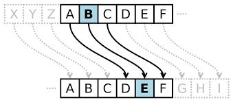

## **CIFRADO CESAR**
***

#### 1. Objetivo:

Cambiar el proyecto de "cifrado César" elaborado en javascript ES5 a la nueva versión ES6.  

#### 2. Descripción:

- El cifrado César mueve cada letra un determinado número de espacios en el alfabeto. En este ejemplo se usa un desplazamiento de 33 espacios, así que una A en el texto original se convierte en una H en el texto codificado.

- En el spint 1 se elaboró el proyecto "cifrado César" con ES5, pero ahora migraremos utilizando la nueva versión ES6 de javascript, para ello se tuvo encuenta los siguientes conceptos:

| N°| Descripción| ES5 | ES6 |
| ---------- | ---------- | ---------- | ---------- |
| 1 | Declaración de variables | var   | var, let y const   |
| 2 | Declarar una función | var mifunction = function (parámetro) {}   | var mifunction = (parámetro) => {} |
| 3 | Imprimir mensaje concatenando | 'Hola' + mivariable   | `Hola ${mivariable}` |

#### 3. Recursos Utilizados:

* HTML5.
* CSS.
* BOOTSTRAP v4.
* JAVASCRIPT ES6.
* JQUERY.
